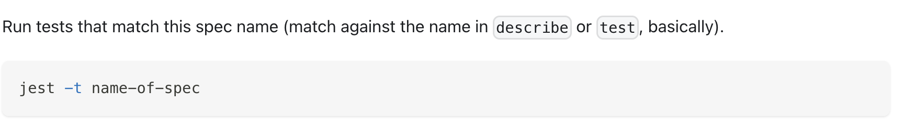
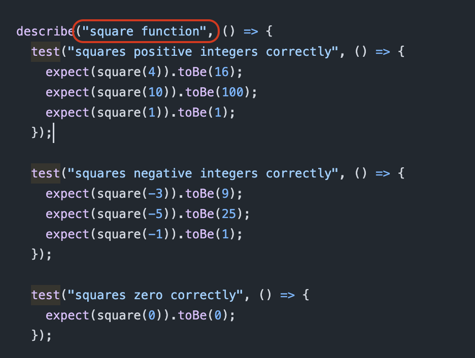
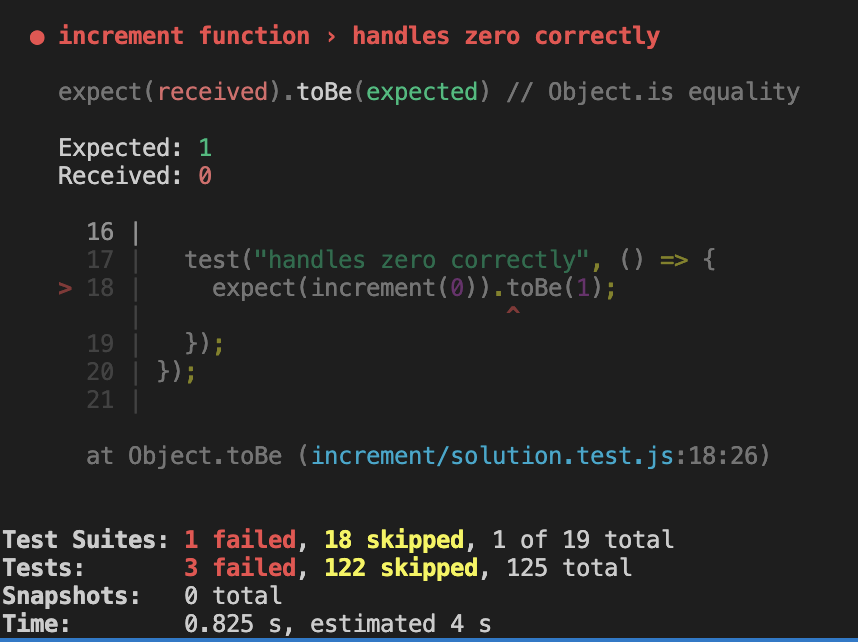
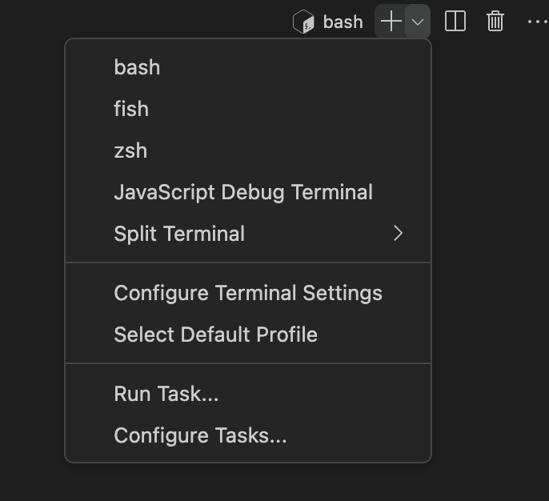
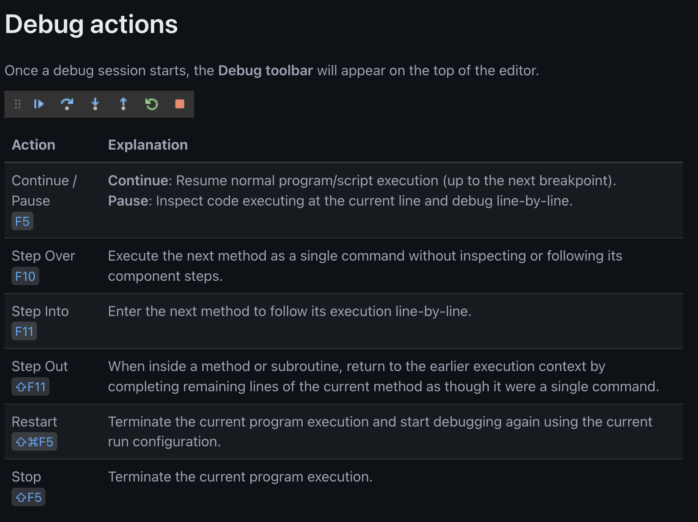

# 🧭 A guide to debugging with Jest

This guide sets out a testing-debugging methodology you can adopt to test and debug your code. It will involve using powerful tools like Jest and the built-in VSCode debugger to identify and explore program behaviour to debug software effectively. If these steps are followed rigorously, you can develop a great mental model for debugging code.

## 🧪 Identify and analyse the function you’re testing

In the README, check the order of functions and identify which function you’re testing. Read the function spec to familiarise yourself with the function’s intended behaviour.

## 📌 Isolate and run tests

In Jest, we can use the `-t` flag to isolate specific test cases:

See this snippet from the docs:

Consider this test suite, we can isolate the tests to run all tests within the `describe` block.

We can use the command: `npm test -- -t "square function"`

For even more specificity, we can isolate specific test cases:

We can use a modified form of the command: `npm test —- -t "squares positive integers correctly"`

## 📕 Read and interpret the tests

From reading the test feedback, double-check the following:

- Which line is the failing test on?
- What is the current output of the function?
- What is the expected output of the function?

## 🔴 Tell the debugger where to pause execution

We can [add breakpoints](https://code.visualstudio.com/docs/editor/debugging#_breakpoints) to our program to tell it where to pause execution of our running program.

## 👣 Step through execution to check the program state during runtime

Next we’ll run our tests in the JavaScript debug terminal - this means the tests will run but the debugger will pause execution at our breakpoints.

Open a **JavaScript Debug Terminal**

Now run the same test command as earlier - this time the debugger will pause execution at breakpoints in the code.

Now we can use the debug control panel to step through the execution of our code.

